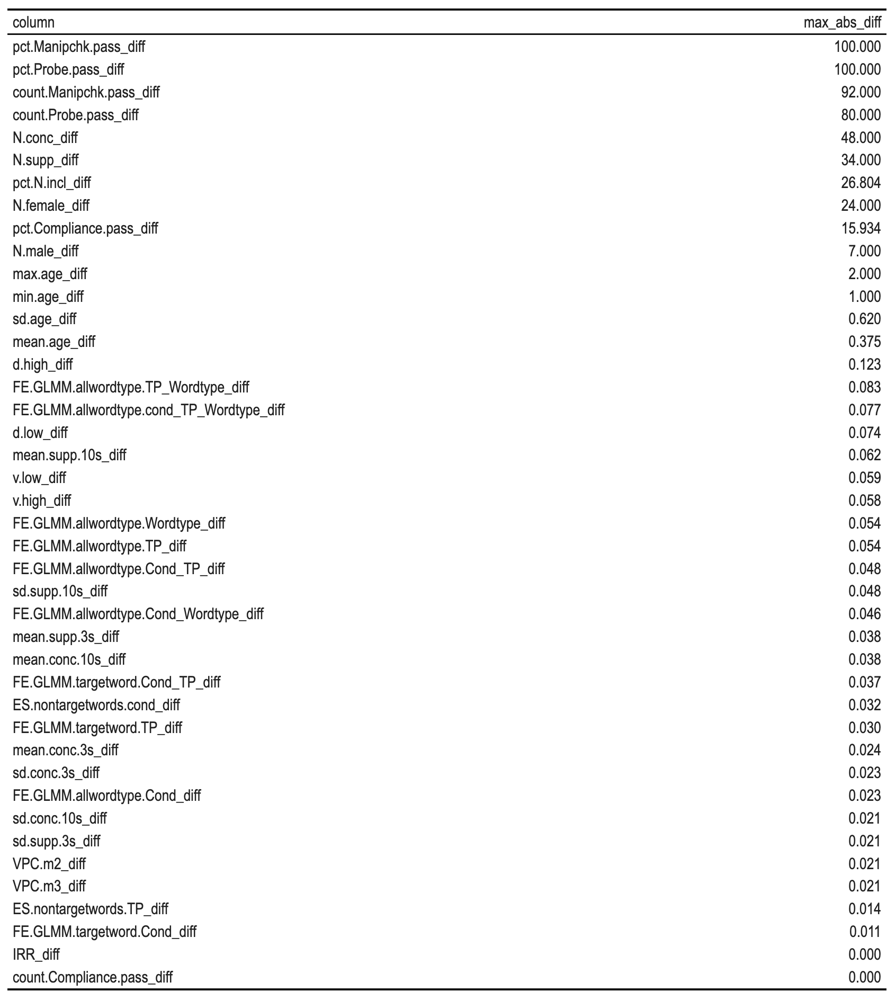

# Inital comments on the data and code

Ian Hussey


## Study 1

### Code cannot run due to missing files

Analysis code relies on "RRR_Hyperaccesibility.xlsx" and RRR_metaWE92 object, neither of which are present on OSF

The only version of RRR_Hyperaccesibility.xlsx on OSF contains simulated data. 

RRR_metaWE92 object is not created or loaded by the code.


### Not computationally reproducible

All three of the manuscript, final data file on OSF, and the reproduced values from the cleaned data+R code all include different estimates for the same estimand.

E.g., spot check:

| Source                                         | Site | mean age | SD age |
| ---------------------------------------------- | ---- | -------- | ------ |
| Manuscript                                     | Ku   | 20.92    | 2.26   |
| RRR_WE92_all.csv                               | Ku   | 19.906   | 2.505  |
| RRR_Study1.R + study 1 cleaned data xlsx files | Ku   | 19.946   | 2.526  |


Table of max differences for each column in RRR_WE92_all.csv vs the RRR_Study1.R + study 1 cleaned data xlsx files:



Differences betwen RRR_WE92_all.csv and the computationally reprodcued files can be found in RRR_Study1_reproducibility.Rmd, RRR_Study1_reproducibility.html, and results_study_1_reproducibility_diffs.csv.


### Code contains errors

##### N.conc and N.supp were calculated incorrectly from the number of columns, not rows

```{r}
# original code, returns number of columns not rows
df1$N.conc = length(subset(RRR_WE92, Cond == "Concentration")) 
df1$N.supp = length(subset(RRR_WE92, Cond == "Suppression"))
# corrected code
df1$N.conc = nrow(subset(RRR_WE92, Cond == "Concentration"))
df1$N.supp = nrow(subset(RRR_WE92, Cond == "Suppression"))
```


##### Mean and SD age for the whole sample are calculated incorrectly

code calculates the mean of the mean-age-per-site (ignoring differences in N) the SD of the mean-age-per-site (can't derive SD from means).

Original: M = 20.75, SD = 1.85

Corrected: M = 20.58, SD = 4.01


#### In appropriate rounding

##### All rounding in the code is done via round(), which does not round the way people think

`round(3.5)`  = 4, but `round(4.5)` also = 4. 

all round() should likely be changed to janitor::round_half_up().


##### Double rounding

`df1` is rounded, then summarized across sites, then rounded again for reporting. Double rounding should be avoided as it distorts estimates.


### Correspondence with manuscript

Not yet checked given that the results are not yet computationally reproducible from code and data.


## Study 2

Not checked yet.

